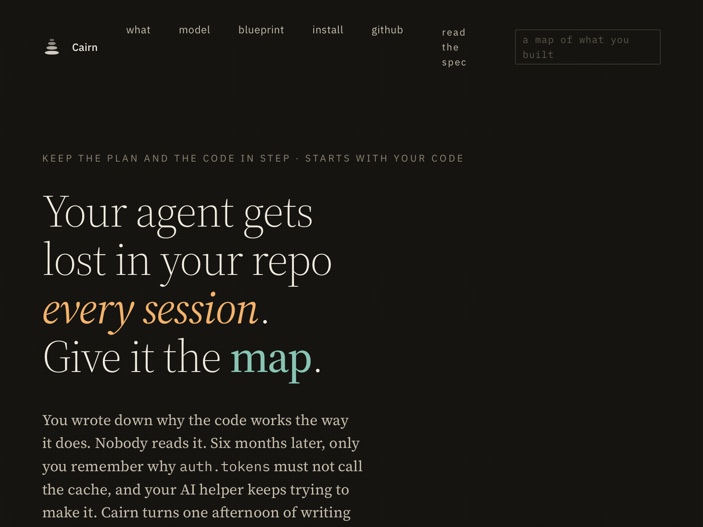
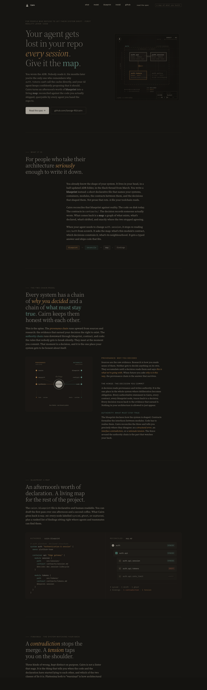
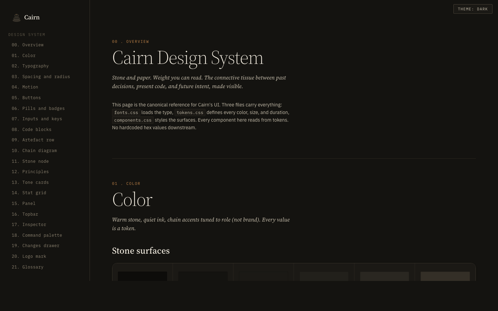
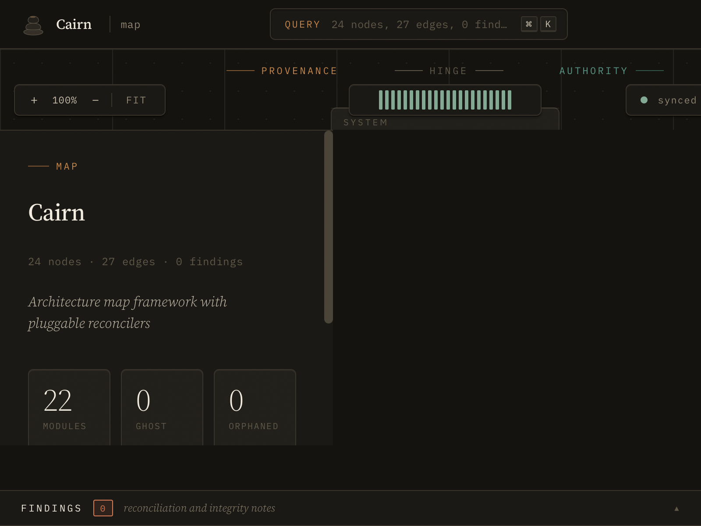

<p align="center">
  
</p>

<h1 align="center">Cairn</h1>

<p align="center">
  <em>Your agent gets lost in your repo every session. Give it the map.</em>
</p>

<!-- badges placeholder: build, crates.io, license once published -->

## Why Cairn

You wrote the ADR. Nobody reads it. Six months later you are the only person who remembers why `auth.tokens` cannot call the cache directly, and your AI agent keeps confidently proposing that it should.

Cairn is the connective tissue between past decisions, present code, and future intent. You author a short declarative `cairn.blueprint` that names your systems, containers, modules, contracts, and the decisions that shaped them. Cairn reconciles that file against the code you actually shipped and produces `map.md`: a graph every agent and teammate can query instead of scanning the repo from scratch.

Claude Code, Cursor, Copilot. They all work best when the structure is explicit, not inferred from file names at 2am. Cairn makes it explicit and gates the commit when the declaration and the code stop agreeing.

## What it does

- Parses a human-authored `cairn.blueprint` into a typed graph (systems, containers, modules, contracts, decisions, research, sources, todos, reviews).
- Reconciles declared nodes against real files on disk and flags `synced`, `ghost`, and `orphaned` state.
- Produces `map.md` with generated frontmatter, active changes, and ranked findings agents can consume.
- Computes deterministic Rust interface hashes and detects contract drift between revisions.
- Surfaces `interface contradictions` (blocking) and `rationale tensions` (advisory) so commits that break the authority chain never land silently.
- Exposes every result as machine-readable JSON so coding agents ground on typed responses, not prose.

## See it

<table>
  <tr>
    <td width="33%" valign="top">
      <a href="docs/landing/index.html"></a>
      <p><strong>Landing page</strong><br>
      <code>docs/landing/index.html</code><br>
      Hosted at <a href="https://george-rd.github.io/cairn/">george-rd.github.io/cairn</a> once GitHub Pages is enabled.</p>
    </td>
    <td width="33%" valign="top">
      <a href="docs/design-system/README.md"></a>
      <p><strong>Design system</strong><br>
      <code>docs/design-system/</code><br>
      Tokens, fonts, components, and a live reference page every Cairn surface grounds on.</p>
    </td>
    <td width="33%" valign="top">
      
      <p><strong>Graph Explorer</strong><br>
      <code>cairn ui</code><br>
      Local browser UI for walking the reconciled map. Runs against the current scan.</p>
    </td>
  </tr>
</table>

## Status

Specification complete (v0.7). Phase 1 kernel shipped. Phase 2 and later are ongoing under `openspec/changes/`. See `docs/spec.md` for the full specification.

## Quickstart

```sh
# 1. Clone and build
git clone https://github.com/George-RD/cairn.git && cd cairn && cargo build --release

# 2. Initialise a blueprint in your repo
cairn init

# 3. Scan and query
cairn scan
cairn neighbourhood <node-id>
```

Full CLI surface is listed below and in `docs/spec.md`.

## Development

Cairn is a Rust workspace. After cloning, install the local Git format hook:

```sh
scripts/install-pre-commit-hook.sh
```

The hook recreates `.git/hooks/pre-commit`, which is not committed by Git, and runs `cargo fmt --check` plus `cairn hook all` before each commit.

Run the local quality suite before pushing:

```sh
make check
```

`make check` runs `cargo fmt --check`, `RUSTFLAGS="-D warnings" cargo clippy --all-targets --all-features`, `cargo test`, and `RUSTDOCFLAGS="-D warnings" cargo doc --no-deps`.

The Conflux archive gate for this repository is `scripts/pre-archive-rust-gates.sh`. It enforces formatting, strict Clippy, and tests before a change is archived.

Agent-side conventions live in `AGENTS.md`. For any UI, landing, or visual work, start at `docs/design-system/README.md`.

## Phase 1 Kernel

The Phase 1 kernel parses `cairn.blueprint`, builds a queryable map graph, loads contract Markdown artefacts, reconciles Rust source files against declared module paths, and exposes the first CLI query surface.

Common commands:

```sh
cairn init
cairn scan
cairn get <node-id> --json
cairn neighbourhood <node-id>
cairn files <node-id>
cairn contract <node-id>
cairn depends <node-id> --transitive
cairn dependents <node-id>
cairn order
cairn lint --json
cairn hook structural
cairn hook interface
cairn hook tension
cairn hook all --json
```

Every Phase 1 command accepts `--file <path>` to select a blueprint file and `--json` to render the same typed response structs as stable machine-readable JSON.

Phase 1 implements only contract artefacts. A contract is a Markdown file with frontmatter containing `node: <id>`, and `cairn contract <node-id>` returns the parsed body. Other artefact pointers (todos, decisions, research, reviews, sources) are retained as raw blueprint metadata but are not interpreted until Phase 2.

`cairn scan` regenerates:

- `map.md` with generated frontmatter, synced nodes, ghost nodes, active changes, and findings.
- `.cairn/log.md` with an appended scan event.
- `.cairn/state/interface-hashes.json` with deterministic Rust interface hash state.

## Hooks

Hooks enforce the integrity classes from `docs/spec.md`:

- `cairn hook structural` exits `1` when structural errors or active-change conflicts exist.
- `cairn hook interface` exits `1` when the current interface hash differs from `.cairn/state/interface-hashes.json`.
- `cairn hook tension` prints advisory findings and always exits `0`.
- `cairn hook all` runs all classes. Structural and interface failures determine the exit code; tensions do not fail the hook.

Every hook accepts `--json`, `--file <path>`, and `--changes-dir <path>`. Use `scripts/cairn-hook-all.sh` from Git hooks or agent task-end hooks so the same engine runs in every boundary.

## Design system

All UI work grounds on `docs/design-system/`: tokens, fonts, components, and a single-page live reference. Colors, spacing, radius, and motion come from `docs/design-system/tokens.css`; nothing hardcodes hex values in components. See `docs/design-system/README.md` for consumption patterns for the marketing site, the embedded Rust web UI, and any future surface.

## Landing page

The marketing landing lives at `docs/landing/index.html`. It is static HTML consuming the design system. Deployment is wired through the GitHub Actions Pages workflow at `.github/workflows/pages.yml`. Once Pages is enabled in repo Settings, the site is live at `https://george-rd.github.io/cairn/`.

## Reference

- `docs/spec.md`: Cairn v0.7 specification
- `docs/blueprint.md`: blueprint grammar reference
- `docs/design-system/README.md`: design system consumption patterns
- `test/fixtures/cairn.blueprint`: example blueprint file
- `meta/campaigns/rust-full-spec.md`: implementation roadmap
- `AGENTS.md`: agent-facing conventions for working in this repo
- `CLAUDE.md`: repo-level notes, terminology state, and workflow conventions
