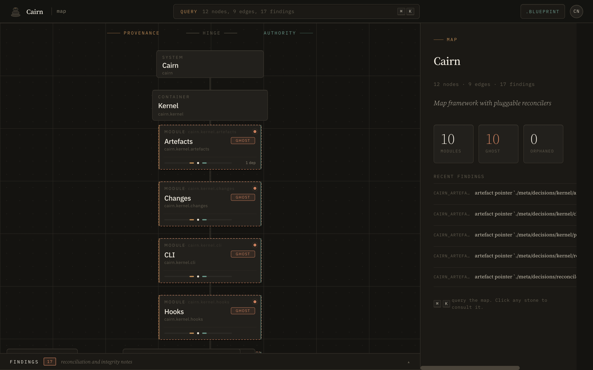
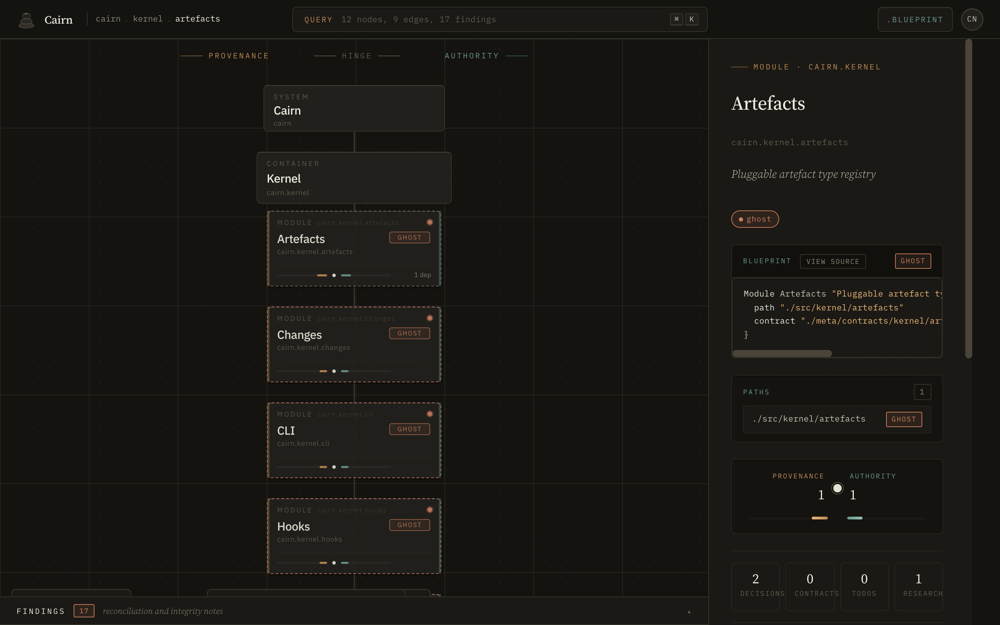
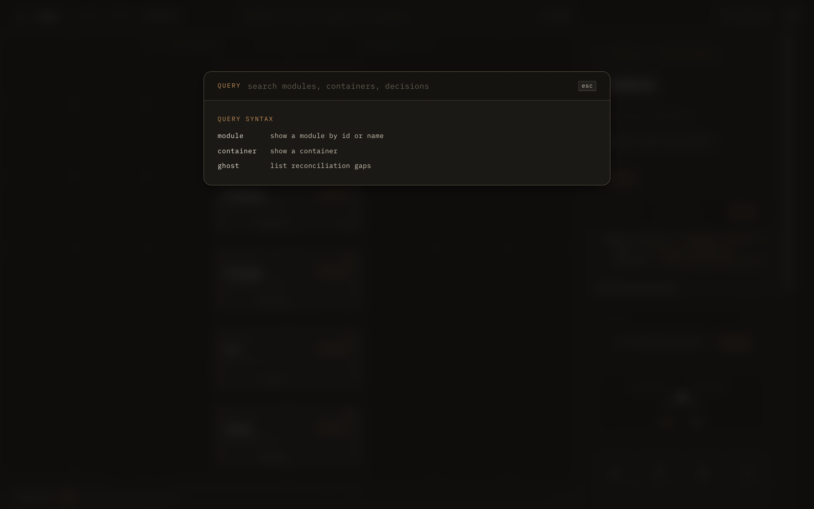

# Cairn

> Your agent gets lost in your repo every session. Give it the map.

Cairn is the connective tissue between past decisions, present code, and future intent. You author a short declarative `cairn.blueprint` that names your systems, containers, modules, contracts, and the decisions that shaped them. Cairn reconciles that file against the code you actually shipped, produces `map.md` (a graph agents can query), and blocks the commit when the declaration and the code stop agreeing.

Claude Code, Cursor, Copilot all work best when the structure is explicit, not inferred from file names at 2am. Cairn makes it explicit.



Live landing: **[george-rd.github.io/cairn](https://george-rd.github.io/cairn/)** · Spec: **[docs/spec.md](docs/spec.md)**

## What it does

- Parses a human-authored `cairn.blueprint` into a typed graph (systems, containers, modules, contracts, decisions, research, sources, todos, reviews).
- Reconciles declared nodes against real files on disk and flags `synced`, `ghost`, and `orphaned` state.
- Produces `map.md` with generated frontmatter, active changes, and ranked findings agents can consume.
- Computes deterministic Rust interface hashes and detects contract drift between revisions.
- Surfaces `interface contradictions` (blocking) and `rationale tensions` (advisory) so commits that break the authority chain never land silently.
- Exposes every result as machine-readable JSON so coding agents ground on typed responses, not prose.

## Install

```sh
cargo install --git https://github.com/George-RD/cairn --branch dev
cairn init                # scaffold cairn.blueprint
cairn scan                # reconcile, emit map.md
cairn ui                  # open the graph explorer at http://127.0.0.1:3000
```

No crates.io release yet. Install from source against the `dev` branch.

## Status

Cairn v0.7 specification is complete. Implementation is phased.

| Phase | Status | Notes |
|---|---|---|
| Phase 0: foundation | shipped | [archive](openspec/changes/archive/phase-0-foundation/) |
| Phase 1: kernel | shipped | [archive](openspec/changes/archive/phase-1-kernel/) |
| Phase 2: artefacts | shipped | [archive](openspec/changes/archive/phase-2-artefacts/) |
| Phase 2.5: graph explorer | shipped | [archive](openspec/changes/archive/phase-2.5-graph-explorer/) |
| Phase 2.6: terminology rename | shipped | [archive](openspec/changes/archive/phase-2.6-terminology-rename/) |
| Phase 3: changes | shipped | [archive](openspec/changes/archive/phase-3-changes/) |
| Phase 4: hooks | shipped | [archive](openspec/changes/archive/phase-4-hooks/) |
| Phase 5: edges & docstrings | shipped | [archive](openspec/changes/archive/phase-5-edges-docstrings/) |
| Phase 6: multi-target | shipped | [archive](openspec/changes/archive/phase-6-multi-target/) |
| Phase 7: mcp | shipped | [archive](openspec/changes/archive/phase-7-mcp/) |
| webui v2 | shipped | hinge layout, inspector, palette: `src/ui_assets/` |
| Phase 8: summariser | in flight | [proposal](openspec/changes/phase-8-summariser/) |
| Phase 9: brownfield | in flight | [proposal](openspec/changes/phase-9-brownfield/) |
| Phase 10: distribution | in flight | [proposal](openspec/changes/phase-10-distribution/) |

See [`openspec/changes/`](openspec/changes/) for active proposals and [`openspec/changes/archive/`](openspec/changes/archive/) for shipped history.

## Screenshots

| Empty map | Module selected | Command palette |
|---|---|---|
| [](docs/images/webui-v2-empty.png) | [](docs/images/webui-v2-module.png) | [](docs/images/webui-v2-palette.png) |

## Reference

- [`docs/spec.md`](docs/spec.md): Cairn v0.7 specification
- [`docs/blueprint.md`](docs/blueprint.md): blueprint grammar reference
- [`docs/design-system/README.md`](docs/design-system/README.md): design system consumption patterns
- [`test/fixtures/cairn.blueprint`](test/fixtures/cairn.blueprint): example blueprint file
- [`AGENTS.md`](AGENTS.md): agent-facing conventions
- [`CONTRIBUTING.md`](CONTRIBUTING.md): build, test, hooks, kernel commands

## License

Dual-licensed under Apache-2.0 or MIT, at your option.
