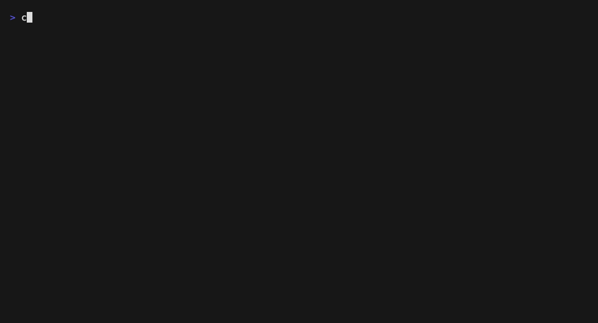
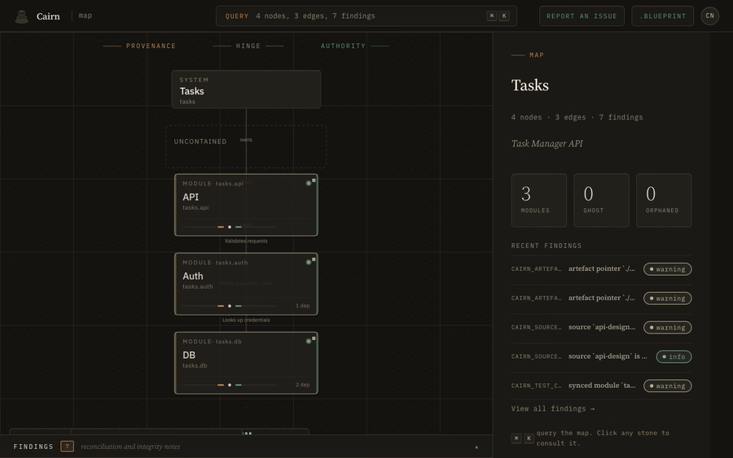

<p align="center">
  
</p>

<h1 align="center">Cairn</h1>

<p align="center">
  <em>Your agent gets lost in your repo every session. Give it the map.</em><br>
  <strong>A living map of your code that AI helpers read before they build, and that catches them when they break the plan.</strong>
</p>

<p align="center">
  <a href="https://github.com/cairn-framework/cairn/actions/workflows/ci.yml"></a>
  <a href="https://github.com/cairn-framework/cairn/releases/latest"></a>
  <a href="https://github.com/cairn-framework/cairn/blob/main/LICENSE-MIT"></a>
</p>

<p align="center">
  
</p>

## What is Cairn

Picture a big codebase that many people and AI helpers all change at once. It is easy to break something, because nobody can see the whole thing at one time.

Cairn is a map of your code that is always kept true. You write down the plan: what the parts are, what each one is for, and how they fit. Cairn then checks the real code against that plan. When the code and the plan stop matching, Cairn says so. And it hands the plan to every AI helper, so they start out knowing where they are instead of guessing.

It works like a floor plan for a house. A floor plan shows you which walls hold the house up, so you do not knock down the wrong one. Cairn shows which parts of your code hold everything else up, so you (or an AI helper) do not break them by accident.

Cairn does three things:

1. **You write the plan.** What the parts are and how they fit.
2. **Cairn keeps the plan and the code matching.** If they drift apart, it tells you.
3. **It hands the plan to every helper.** So nobody gets lost or breaks things.

## Why Cairn

Other tools do half the job. Knowledge graphs *describe* your code but never stop a bad change. Coding agents *change* your code but have no sense of the plan. Static analysis checks spelling and style, not whether a change fits.

Cairn is the missing piece in the middle. You write the plan in a `cairn.blueprint` file. Cairn checks that plan against the code you actually shipped, blocks commits that break it, and gives every agent a map drawn from the real code, not a guess.

| Gap | What exists today | What Cairn adds |
|---|---|---|
| **Knowledge graphs** | Describe structure. No enforcement. | Declares structure *and* gates against drift from it. |
| **Coding agents** | Act on code. No architectural memory. | Persistent map agents query instead of re-scanning. |
| **Static analysis** | Checks syntax and style. | Checks architectural intent: dependencies, contracts, decisions. |

## How it works

```
blueprint  -->  reconcile  -->  gate  -->  query
(declare)      (scan code)    (enforce)   (serve agents)
```

1. **Write the plan (declare).** Make a `cairn.blueprint` that names your systems, modules, the promises each part makes, and the decisions behind them.
2. **Check it (reconcile).** `cairn scan` reads the code and marks each part `synced` (matches the plan), `ghost` (planned but not built yet), or `orphaned` (built but not in the plan).
3. **Guard it (gate).** A pre-commit check blocks changes that break the plan, and warns about changes that fight an old decision.
4. **Ask it (query).** `cairn get`, `cairn neighbourhood`, and `cairn context` hand back clean data, so agents build on facts instead of guesses.

## Quickstart

```sh
curl --proto '=https' --tlsv1.2 -LsSf https://github.com/cairn-framework/cairn/releases/latest/download/cairn-installer.sh | sh
cairn init                                                          # scaffold blueprint + config + agent guide
cairn scan                                                          # reconcile against code
```

<p align="center">
  
</p>

Already have a codebase? `cairn init --from-code` reads your source tree and writes a draft plan for you to review, instead of an empty starter. `cairn onboard` then groups any leftover files and suggests where they fit.

See [docs/quickstart.md](docs/quickstart.md) for prerequisites, other install methods, and a full first-run walkthrough. The blueprint grammar is in [docs/blueprint.md](docs/blueprint.md), and the command list in [docs/commands.md](docs/commands.md).

## Using Cairn with coding agents

Cairn is built to be an agent's source of truth about your code, both ways:

- **Plan in.** `cairn init` writes `.cairn/AGENTS.md`, a ready-made section for your project's `CLAUDE.md` or `AGENTS.md`. It teaches agents the orientation commands (`cairn context`, `cairn get`, `cairn neighbourhood`), the rule to keep the plan in sync, and the pre-commit gate.
- **Clean answers out.** Commands take `--json` and return a stable, command-specific JSON shape (each carries a `schema_version`), so agents read structure instead of prose. `cairn-mcp` serves the same query API as MCP tools (see [docs/mcp.md](docs/mcp.md) and [docs/claude-code.md](docs/claude-code.md)).
- **Problems back to us.** When Cairn itself trips up on your project (a confusing message, a wrong finding, a missing feature), `cairn feedback "<what happened>"` saves it to `.cairn/feedback.md` and prints a ready-to-file issue link for [this repo's tracker](https://github.com/cairn-framework/cairn/issues). The agent guide tells agents to do this instead of quietly working around the problem, so every project that uses Cairn helps improve it.

A pattern that works well for new code: write the parts you plan to build in the blueprint before any code exists. They show up as `ghost` nodes, agents treat them as a to-do list, and `cairn scan` confirms each one as it becomes real code.

## What the map holds

The map is more than shape. Every node carries real, file-backed content, all saved in git next to your code:

- **What is there.** Systems, containers, modules, and how they depend on each other: the shape of what exists.
- **What each part should do.** A `contract` per module (purpose, public interface, rules, tests), kept honest by drift detection.
- **Why it is built this way.** `decision` records with typed history (`supersedes`, `informed_by`, `revisit_triggers`).
- **What is left to do.** `todo` notes attached to nodes, plus `ghost` nodes for parts you mean to build but have not built yet.

Because all of it is markdown in the repo, it gets git history, diff, blame, and branching for free, and it travels with the code instead of rotting in a separate tool. `cairn todos <id>` lists a node's open work; `cairn status` gathers open work, active changes, and recent activity across the whole map.

Task trackers stay optional. If your team already runs one such as beads, Cairn shows its node-linked items as a read-only view in the inspector, without treating it as a second source of truth. The task content lives in Cairn; an outside tracker is just another place to show it.

## The Kubernetes analogy

Cairn works the same way Kubernetes does: declare the state you want, keep checking the real state against it, and reject changes that break it.

| Cairn | Kubernetes | Role |
|---|---|---|
| `cairn.blueprint` | Manifests (YAML) | Declared desired state |
| Scanner | Controllers | Reconciliation loop |
| Drift gate / hooks | Admission webhooks | Reject invalid mutations |
| Artefact types | CRDs | Typed extensions |
| Map (graph) | etcd | Reconciled state store |
| CLI (`cairn get`, `cairn scan`) | kubectl | Operator interface |
| Reconcilers (tree-sitter, etc.) | Operators | Pluggable domain logic |

## What it does

- Reads a human-written `cairn.blueprint` into a typed graph (systems, containers, modules, contracts, decisions, research, sources, todos, reviews).
- Checks declared nodes against real files on disk and marks `synced`, `ghost`, and `orphaned` state. The code reconciler speaks Rust, TypeScript, Python, and Go via tree-sitter, extracting structured public symbols (`cairn symbols <id>`) rather than flattening them into a hash.
- Writes `map.md` (human-readable) and a committed, deterministic `map.json` snapshot with generated frontmatter, active changes, and ranked findings agents can read.
- Computes steady interface hashes and spots contract drift between revisions; contracts can declare an `interface:` block checked against extracted symbols.
- Surfaces `interface contradictions` (blocking) and `rationale tensions` (advisory), so commits that break the chain never land quietly.
- Tracks structured changes (`meta/changes/`) with delta semantics and an acceptance gate (`cairn accept`); the change system is format, validation, and apply/archive only, not a task scheduler.
- Gives agents what they need to build a ghost node: `cairn bundle <id>` (contract, decisions, and dependency interfaces in one call) and `cairn gap <id> --question` to log a genuine underspecification instead of guessing. `cairn frontier` reports what is buildable now versus blocked on an unbuilt dependency.
- Aggregates status, lint, and frontier queries across several related projects with `cairn workspace`, when `cairn.workspace` declares member projects.
- Onboards existing codebases: `cairn init --from-code` extraction, `cairn refine` re-discovery, `cairn onboard` orphan triage, `cairn islands` for disconnected parts.
- Hands back every result as machine-readable JSON, as MCP tools (`cairn-mcp`), and in a local web explorer (`cairn ui`).

## Commands at a glance

| Need | Command |
|---|---|
| Orientation for a session | `cairn context` |
| Reconcile blueprint against code | `cairn scan` (`--strict` for CI) |
| Inspect a node / its surroundings | `cairn get <id>`, `cairn neighbourhood <id>` |
| Dependency questions | `cairn depends <id>`, `cairn dependents <id>`, `cairn order`, `cairn islands`, `cairn frontier` |
| Provenance questions | `cairn rationale <id>`, `cairn decisions <id>`, `cairn research <id>`, `cairn sources <id>` |
| Work for a node or the whole graph | `cairn todos <id>`, `cairn status`, `cairn symbols <id>` |
| Findings | `cairn lint`, `cairn check` |
| Commit gates | `cairn hook structural\|interface\|tension\|all` |
| Changes | `cairn change new <id>`, `cairn changes`, `cairn show <id>`, `cairn accept` |
| Brownfield | `cairn init --from-code`, `cairn refine`, `cairn onboard` |
| Generate from intent | `cairn bundle <id>`, `cairn gap <id> --question "<text>"` |
| Multi-project workspaces | `cairn workspace status\|lint\|frontier` |
| Export | `cairn export --format json\|md\|mermaid` |
| Web explorer | `cairn ui --port 3000` |
| Report Cairn friction | `cairn feedback "<message>"` |

Run `cairn --help` for the full list; commands accept `--file <path>` and `--json` (`cairn init` is the exception: it always scaffolds the current directory). Full reference: [docs/commands.md](docs/commands.md).

## Hooks

Hooks enforce the integrity classes from `docs/spec.md`:

- `cairn hook structural` exits `1` when structural errors or active-change conflicts exist.
- `cairn hook interface` exits `1` when the current interface hash differs from `.cairn/state/interface-hashes.json`.
- `cairn hook tension` prints advisory findings and always exits `0`.
- `cairn hook all` runs all classes. Structural and interface failures set the exit code; tensions do not fail the hook.

Every hook accepts `--json`, `--file <path>`, and `--changes-dir <path>`. Use `scripts/cairn-hook-all.sh` from Git hooks or agent task-end hooks so the same engine runs at every boundary.

<p align="center">
  
</p>

## See it

<table>
  <tr>
    <td width="33%" valign="top">
      <a href="docs/landing/index.html"></a>
      <p><strong>Landing page</strong><br>
      <code>docs/landing/index.html</code><br>
      Live at <a href="https://cairn-framework.github.io/cairn/">cairn-framework.github.io/cairn</a>.</p>
    </td>
    <td width="33%" valign="top">
      <a href="docs/design-system/README.md"></a>
      <p><strong>Design system</strong><br>
      <code>docs/design-system/</code><br>
      Tokens, fonts, components, and a live reference page every Cairn surface grounds on.</p>
    </td>
    <td width="33%" valign="top">
      
      <p><strong>Graph Explorer</strong><br>
      <code>cairn ui</code><br>
      Local browser UI for walking the reconciled map. Runs against the current scan.</p>
    </td>
  </tr>
</table>

## Status

Specification v0.8 ([docs/spec.md](docs/spec.md)). The kernel, artefact registry, change tracking, brownfield onboarding, hooks, MCP server, and web explorer have all shipped; Cairn is not yet on crates.io and the CLI surface may still move. This repository uses Cairn on itself: the root `cairn.blueprint` describes Cairn, and the commit gate runs `cairn hook all`.

## Feedback

Something confusing or broken? Run `cairn feedback "<what you expected, what happened instead>"`. It saves your note to `.cairn/feedback.md` and prints a link you can open to file it upstream. If `cairn` crashes, it prints the same kind of link on its own.

Nothing is ever sent for you. No telemetry, no background network calls. Every report is a link you choose to open in your own browser.

## Development

Cairn is a Rust workspace. After cloning, install the local Git format hook:

```sh
scripts/install-pre-commit-hook.sh
```

The hook recreates `.git/hooks/pre-commit`, which is not committed by Git, and runs `cargo fmt --check` plus `cairn hook all` before each commit.

Run the local quality suite before pushing:

```sh
make check
```

`make check` runs `cargo fmt --check`, `RUSTFLAGS="-D warnings" cargo clippy --all-targets --all-features`, `cargo test`, and `RUSTDOCFLAGS="-D warnings" cargo doc --no-deps`.

Active change proposals live under `meta/changes/`; archived phases under `archive/openspec/` are kept as history. Agent-side conventions live in `AGENTS.md`. For any UI, landing, or visual work, start at `docs/design-system/README.md`.

## Design system

All UI work grounds on `docs/design-system/`: tokens, fonts, components, and a single-page live reference. Colours, spacing, radius, and motion come from `docs/design-system/tokens.css`; nothing hardcodes hex values in components. See `docs/design-system/README.md` for consumption patterns for the marketing site, the embedded Rust web UI, and any future surface.

## Landing page

The marketing landing lives at `docs/landing/index.html`. It is static HTML consuming the design system. Deployment is wired through the GitHub Actions Pages workflow at `.github/workflows/pages.yml`; the site is live at `https://cairn-framework.github.io/cairn/` and redeploys on every push to `main`.

## Reference

- `docs/spec.md`: Cairn v0.8 specification
- `docs/quickstart.md`: install and first-run walkthrough
- `docs/blueprint.md`: blueprint grammar reference
- `docs/commands.md`: CLI command reference
- `docs/mcp.md` and `docs/claude-code.md`: agent and MCP integration
- `docs/design-system/README.md`: design system consumption patterns
- `test/fixtures/cairn.blueprint`: example blueprint file
- `AGENTS.md`: agent-facing conventions for working in this repo
- `CLAUDE.md`: repo-level notes, terminology state, and workflow conventions
