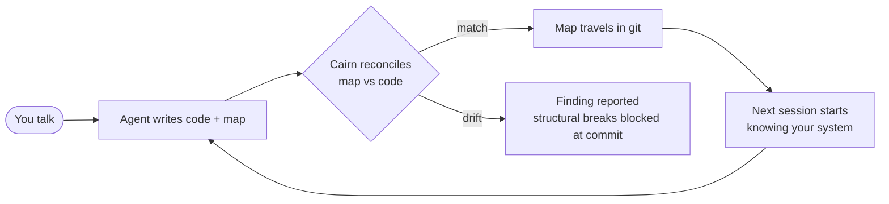

<h1 align="center">Cairn</h1>

<p align="center">
  <em>The architecture memory your agent writes itself.</em><br>
  <strong>Stop re-explaining your codebase every session. Your agent builds the map, you never write it by hand, and it is plain markdown you can delete.</strong>
</p>

<p align="center">
  <a href="https://github.com/cairn-framework/cairn/actions/workflows/ci.yml"></a>
  <a href="https://github.com/cairn-framework/cairn/releases/latest"></a>
  <a href="https://github.com/cairn-framework/cairn/releases"></a>
  <a href="https://github.com/cairn-framework/cairn/blob/main/LICENSE-MIT"></a>
  <a href="https://ko-fi.com/george_builds"></a>
</p>

<p align="center">
  
</p>

## What is Cairn

**For developers who build with AI coding agents (Claude Code, Cursor, Codex, OMP, and friends).**

Cairn is built for you if any of this sounds familiar:

- Your agent re-reads the repo every session and still gets lost. Context burns.
- Your agent forgets decisions and rebreaks things you settled weeks ago.
- Work across sessions or agents drifts from the plan, and you find out too late.

Cairn fixes that. You talk to your agent about what to build. Your agent writes the declarations as you talk: the blueprint, the contracts, the decisions. Cairn checks those declarations against the real code, and writes the map as the reviewable view of the result. A declaration that disagrees with the code shows up as a finding, the same as wrong code. Because those declarations can be proven wrong, you can actually trust what they say. Every future session picks up the same map and starts already knowing your system.

You do almost nothing. Your agent drafts the first blueprint in one command, and keeps it in sync as part of the work you already asked for. The declarations and all of their notes are plain text in your repo, alongside a small config file and the generated map. Cairn is local-first, so your project data stays on your machine. If you ever want out, run `cairn pack uninstall`, which retires the pack files Cairn owns and has not seen edited. Delete any pack file you edited yourself. Then delete `.cairn/`, `cairn.blueprint`, `cairn.config.yaml`, the generated map files, the empty scaffolded `meta/` folders, and Cairn's block in your agent instructions file.

Think of it like a floor plan for a house. A floor plan shows which walls hold the house up, so you do not knock down the wrong one. Cairn shows which parts of your code hold everything else up, so your agent does not break them by accident.

Cairn does three things:

1. **Your agent writes the map.** What the parts are and how they fit, noted as you build.
2. **Cairn keeps the map and the code matching.** If they drift apart, it tells you.
3. **It hands the map to every session.** So no agent gets lost or breaks things.


```mermaid
flowchart LR
    Y([You talk]) --> A[Agent writes code + map]
    A --> C{Cairn reconciles<br>map vs code}
    C -->|match| M[Map travels in git]
    C -->|drift| F[Finding reported<br>structural breaks blocked at commit]
    M --> S[Next session starts<br>knowing your system]
    S --> A
```

Cairn is not mainly for people who want to hand-draw architecture diagrams or author UML-style models. You can still do that. Cairn supports hand-written blueprints. But that is the secondary path. The main path is your agent writing the map while you build.

## What you actually gain

Three things change the day your agent starts writing the map.

- **Leaner context.** Agents query the map (`cairn context`, `cairn get`, `cairn bundle`) instead of re-reading the source tree, and get structured JSON they can act on.
- **Drift blocked at commit.** `cairn hook all` blocks commits that fight the declared structure or contracts, so the mistake stops at the boundary before anyone has to review it.
- **Memory across sessions.** Decisions and the reasons behind them live next to the code in git. A fresh session inherits them instead of re-deriving them.

## Quickstart

The fastest path: let your agent do the whole setup. Paste this into it:

```text
Read https://raw.githubusercontent.com/cairn-framework/cairn/main/docs/agent-setup.md
and follow it to set up Cairn in this repo. Walk me through each decision.
```

Your agent installs the CLI, detects whether this is a new or existing
project, drafts the map with you, wires itself in, and arms the gate. See
[docs/agent-setup.md](docs/agent-setup.md) for the steps it follows.

Prefer to drive it yourself?

```sh
curl --proto '=https' --tlsv1.2 -LsSf https://github.com/cairn-framework/cairn/releases/latest/download/cairn-installer.sh | sh
cairn init --wire                                                   # scaffold, install the agent pack, and wire its pointer
cairn scan                                                          # reconcile against code
```

<p align="center">
  
</p>

Already have a codebase? Run `cairn init --from-code --apply --wire` to draft the blueprint from your source tree, land it, install the agent pack, and wire its pointer in one step. Drop `--apply --wire` to review the proposal first, land it with `cairn change apply brownfield-init`, then run `cairn init --wire`.

Once the draft is applied, `cairn scan` writes the map and lists every place the map and the code disagree: files on disk that no module claims (orphans), modules planned but not yet built (ghosts), and mismatches between the two. `cairn onboard` groups the leftover files and suggests where they fit. The gate only catches intent you have actually declared: contracts and decisions. Spell those out and the gate arms itself.

See [docs/quickstart.md](docs/quickstart.md) for prerequisites, other install methods, and a full first-run walkthrough. The blueprint grammar is in [docs/blueprint.md](docs/blueprint.md), and the command list in [docs/commands.md](docs/commands.md).

**The clean exit.** Try Cairn on a branch. If you hate it, run `cairn pack uninstall` to retire the pack files Cairn owns and has not seen edited, then delete any pack file you edited yourself. Delete `cairn.blueprint`, `cairn.config.yaml`, `.cairn/`, the generated map files, and the empty scaffolded `meta/` folders. Last, take Cairn's block back out of your agent instructions, or delete that file if Cairn created it.

**Local-first.** Cairn runs on your machine and your project data stays there.

## The deep dive

If you want the mechanics, the rest of this page explains how Cairn works, what lives in the map, and every command.

## Why Cairn

Other tools do half the job. Knowledge graphs describe your code but cannot stop a bad change. Coding agents change your code without any sense of the plan, and static analysis checks style rather than whether a change fits.

Cairn sits in the middle. Your agent writes the plan in a `cairn.blueprint` file as part of the work you already asked it to do. Cairn checks that plan against the code you actually shipped, blocks commits that break it, and gives every agent a map drawn from the real code.

| Gap | What exists today | What Cairn adds |
|---|---|---|
| **Knowledge graphs** | Describe structure. No enforcement. | Declares structure *and* gates against drift from it. |
| **Coding agents** | Act on code. No architectural memory. | Persistent map agents query instead of re-scanning. |
| **Static analysis** | Checks syntax and style. | Checks architectural intent: dependencies, contracts, decisions. |

## See the map

`cairn ui` opens the graph explorer in your browser. This is Cairn mapping itself: every module, its state, and the dependencies between them in one bounded view.

<a href="https://raw.githubusercontent.com/cairn-framework/cairn/main/docs/assets/screenshots/webui-graph.png"></a>

Click any node and the map lights up its dependencies while the evidence rail shows the node's facts, decision lineage, and its slice of the blueprint.

<a href="https://raw.githubusercontent.com/cairn-framework/cairn/main/docs/assets/screenshots/webui-node-focus.png"></a>

## How it works

```
blueprint  -->  reconcile  -->  gate  -->  query
(declare)      (scan code)    (enforce)   (serve agents)
```

Cairn is a closed loop: your agent declares the architecture you want, it measures the one you shipped, and it blocks drift at the commit boundary. The map is what that loop produces and what your agents read.

1. **Write the plan (declare).** Your agent writes a `cairn.blueprint` that names your systems, modules, the promises each part makes, and the decisions behind them. You can write it by hand too, but most teams let the agent do it while they build.
2. **Check it (reconcile).** `cairn scan` reads the code and marks each part `synced` (matches the plan), `ghost` (planned but not built yet), or `orphaned` (built but not in the plan).
3. **Guard it (gate).** A pre-commit check blocks changes that break the plan, and warns about changes that fight an old decision.
4. **Ask it (query).** `cairn get`, `cairn neighbourhood`, and `cairn context` hand back clean data, so agents build on facts instead of guesses.

## Built for your coding agent

Cairn puts your coding agent at the centre. The agent is the main reader and writer of the map, both ways:
- **Plan in.** `cairn init --wire` writes `.cairn/AGENTS.md`, installs the owned agent pack, and appends a pointer to your project's `CLAUDE.md` or `AGENTS.md`. The guide teaches agents the orientation commands (`cairn context`, `cairn get`, `cairn neighbourhood`), the rule to keep the plan in sync, and the pre-commit gate.
- **Clean answers out.** Commands take `--json` and return a versioned, command-specific JSON shape (each carries a `schema_version`), so agents read structure instead of prose. `cairn-mcp` serves the same query API as MCP tools (see [docs/mcp.md](docs/mcp.md) and [docs/claude-code.md](docs/claude-code.md)).
- **Problems back to us.** When Cairn itself trips up on your project (a confusing message, a wrong finding, a missing feature), `cairn feedback "<what happened>"` saves it to `.cairn/feedback.md` and prints a ready-to-file issue link for [this repo's tracker](https://github.com/cairn-framework/cairn/issues). The agent guide tells agents to do this instead of quietly working around the problem, so every project that uses Cairn helps improve it.

A pattern that works well for new code: your agent declares the parts you plan to build in the blueprint before any code exists. They show up as `ghost` nodes, agents treat them as a to-do list, and `cairn scan` confirms each one as it becomes real code.

## What the map holds

The map is more than shape. Every node carries real, file-backed content, all saved in git next to your code:

- **What is there.** Systems, containers, modules, and how they depend on each other: the shape of what exists.
- **What each part should do.** A `contract` per module (purpose, public interface, rules, tests), kept honest by drift detection.
- **Why it is built this way.** `decision` records with typed history (`supersedes`, `informed_by`, `revisit_triggers`).
- **What is left to do.** `todo` notes attached to nodes, plus `ghost` nodes for parts you mean to build but have not built yet.

Because all of it is markdown in the repo, it gets git history, diff, blame, and branching for free, and it travels with the code instead of rotting in a separate tool. `cairn todos <id>` lists a node's open work; `cairn status` gathers open work, active changes, and recent activity across the whole map.

Task trackers stay optional. If your team already runs one such as beads, Cairn shows its node-linked items as a read-only view in the detail rail, without treating it as a second source of truth. The task content lives in Cairn; an outside tracker is just another place to show it.

## The Kubernetes analogy

Cairn works the same way Kubernetes does: declare the state you want, keep checking the real state against it, and reject changes that break it.

| Cairn | Kubernetes | Role |
|---|---|---|
| `cairn.blueprint` | Manifests (YAML) | Declared desired state |
| Scanner | Controllers | Reconciliation loop |
| Drift gate / hooks | Admission webhooks | Reject invalid mutations |
| Artefact types | CRDs | Typed extensions |
| Map (graph) | etcd | Reconciled state store |
| CLI (`cairn get`, `cairn scan`) | kubectl | Operator interface |
| Reconcilers (tree-sitter, etc.) | Operators | Pluggable domain logic |

## What it does

- Reads a `cairn.blueprint` (agent-written or hand-written) into a typed graph (systems, containers, modules, contracts, decisions, research, sources, todos, reviews).
- Checks declared nodes against real files on disk and marks `synced`, `ghost`, and `orphaned` state. The code reconciler speaks Rust, TypeScript, Python, and Go via tree-sitter, extracting structured public symbols (`cairn get <id> --symbols`) rather than flattening them into a hash.
- Writes `map.md` (human-readable) and a committed, deterministic `map.json` snapshot with generated frontmatter, active changes, and findings agents can read.
- Computes steady interface hashes and spots contract drift between revisions; contracts can declare an `interface:` block checked against extracted symbols.
- Surfaces `interface contradictions` (blocking) and `rationale tensions` (advisory), so commits that break the chain never land quietly.
- Tracks structured changes (`meta/changes/`) with delta semantics and an acceptance gate (`cairn change accept`); the change system is format, validation, and apply/archive only, not a task scheduler.
- Gives agents what they need to build a ghost node: `cairn bundle <id>` (contract, decisions, and dependency interfaces in one call) and `cairn gap <id> --question` to log a genuine underspecification instead of guessing. `cairn frontier` reports what is buildable now versus blocked on an unbuilt dependency.
- Aggregates status, lint, and frontier queries across several related projects with `cairn workspace`, when `cairn.workspace` declares member projects.
- Onboards existing codebases: `cairn init --from-code` extraction, `cairn refine` re-discovery, `cairn onboard` orphan triage, `cairn islands` for disconnected parts.
- Hands back every result as machine-readable JSON, as MCP tools (`cairn-mcp`), and in a local web explorer (`cairn ui`).

## Commands at a glance

| Need | Command |
|---|---|
| Orientation for a session | `cairn context` |
| Reconcile blueprint against code | `cairn scan` (`--strict` for CI) |
| Inspect a node / its surroundings | `cairn get <id>`, `cairn neighbourhood <id>` |
| Dependency questions | `cairn deps <id>`, `cairn deps <id> --direction in`, `cairn order`, `cairn islands`, `cairn frontier` |
| Provenance questions | `cairn rationale <id>`, `cairn decisions <id>`, `cairn research <id>`, `cairn sources <id>` |
| Work for a node or the whole graph | `cairn todos <id>`, `cairn status`, `cairn get <id> --symbols` |
| Findings | `cairn lint` |
| Commit gates | `cairn hook structural\|interface\|tension\|all` |
| Changes | `cairn change new <id>`, `cairn changes`, `cairn show <id>`, `cairn change accept` |
| Existing codebases | `cairn init --from-code`, `cairn refine`, `cairn onboard` |
| Generate from intent | `cairn bundle <id>`, `cairn gap <id> --question "<text>"` |
| Multi-project workspaces | `cairn workspace status\|lint\|frontier` |
| Export | `cairn export --format json\|md\|mermaid` |
| Web explorer | `cairn ui --port 3000` |
| Report Cairn friction | `cairn feedback "<message>"` |

Run `cairn --help` for the full list; commands accept `--file <path>` and `--json` (`cairn init` is the exception: it always scaffolds the current directory). Full reference: [docs/commands.md](docs/commands.md).

<p align="center">
  
</p>

## Hooks

Hooks enforce the integrity classes from `docs/spec.md`:

- `cairn hook structural` exits `1` when structural errors or active-change conflicts exist.
- `cairn hook interface` exits `1` when the current interface hash differs from `.cairn/state/interface-hashes.json`.
- `cairn hook tension` prints advisory findings and always exits `0`.
- `cairn hook all` runs all classes. Structural and interface failures set the exit code; tensions do not fail the hook.

Every hook accepts `--json`, `--file <path>`, and `--changes-dir <path>`. Use `scripts/cairn-hook-all.sh` from Git hooks or agent task-end hooks so the same engine runs at every boundary.

<p align="center">
  
</p>

## FAQ

**Do I have to write and maintain the blueprint myself?**
No. Your agent writes it as part of the work you already asked for. You can hand-edit if you like, but you never have to.

**Isn't this just AGENTS.md or CLAUDE.md?**
Prose instructions rot in silence. The map is checked against real code on every scan. When the map and the code disagree, Cairn tells you exactly where. AGENTS.md cannot do that.

**Won't agents just get smart enough to infer the architecture?**
Inference tells you what the code is, not what you meant or why. Intent and decisions cannot be read from code, and re-inferring costs context every single session.

**I already have a codebase. Will this help?**
Yes. `cairn init --from-code` drafts the map from your source tree. `cairn onboard` groups the leftovers and says where they fit.

**What about a brand new project?**
Best case: your agent declares parts before the code exists (ghost nodes), builds against them, and `cairn scan` confirms each one as it lands.

**What if my agent writes a wrong blueprint?**
The map is plain markdown that diffs in review like code. `cairn scan` reports every place the map and the code disagree, in both directions, so a wrong declaration shows up as a finding instead of hiding. You arbitrate by editing either side. Cairn does not read your intent, so it will not flag a declaration you meant but that happens to be wrong: it only flags mismatches between what you wrote and what the code does.

**Can an agent just bypass the hook?**
The gate is one command with real exit codes: `cairn hook all`. It is documented for CI pipelines as well as pre-commit (see [docs/hooks.md](docs/hooks.md)), so you can run it where agents cannot skip it, such as a CI job that must pass before a merge.

**Will it drown me in findings?**
No. Only hard findings block a commit: broken structure, a contradicted interface, or (if you enable that gate) an architecture change without a paired decision. Everything else is advice. Cairn reports it, and you choose when to act on it.

## Status

Specification v0.8 ([docs/spec.md](docs/spec.md)). The kernel, artefact registry, change tracking, brownfield onboarding, hooks, MCP server, and web explorer have all shipped, alongside an agent pack that installs and maintains Cairn's own guidance for your coding agent, with adapters for Claude and OMP. Cairn is published to crates.io (`cairn-framework`) and the CLI surface may still move, but every artefact it writes is plain text in your repo (markdown plus a JSON snapshot), so a format change cannot strand your data: you can read or drop it with no special tool. This repository uses Cairn on itself: the root `cairn.blueprint` describes Cairn, and the commit gate runs `cairn hook all`.

## Roadmap

Last reviewed for v0.9.0 (2026-07-27). This is the near-term shape, not a schedule or a commitment. The graph is the live source of truth: run `cairn frontier` for what is buildable now, and `cairn status` for the current backlog and findings.

**Just landed.** The agent pack lifecycle with harness adapters for Claude and OMP, the `cairn-dev` router that loads at most one just-in-time reference per task, and path containment for the pack lifecycle, the campaign lock, and `cairn init` scaffolding.

**Next up.**

- **Typed todo relationships.** Todos carry no dependency or parent-child model, so ordering lives in prose. A schema decision comes first, then the CLI and scanner surfaces that enforce it.
- **Wider symbol coverage.** Rust and TypeScript symbol extraction only sees explicitly public or exported items, which limits what `cairn get <node> --symbols` can report for those languages.
- **Work selection that respects priority.** After findings, `cairn next` picks the oldest open native todo. Priority is unstructured prose today, so Cairn needs a structured priority field before selection can rank by it.

**Not planned.** A scheduler, a runner, or anything that repeats work for you. Iteration belongs to your harness, not to Cairn.

## Feedback

Something confusing or broken? Run `cairn feedback "<what you expected, what happened instead>"`. It saves your note to `.cairn/feedback.md` and prints a link you can open to file it upstream. If `cairn` crashes, it prints the same kind of link on its own.

Every report is a link that opens in your own browser, and nothing gets sent unless you choose to send it.
If Cairn saves you time, the Ko-fi link in the header is how to say thanks.

## Development

Cairn is a Rust workspace. After cloning, install the local Git format hook:

```sh
scripts/install-pre-commit-hook.sh
```

The hook recreates `.git/hooks/pre-commit`, which is not committed by Git, and runs `cargo fmt --check` plus `cairn hook all` before each commit.

To resolve `map.json` merge conflicts automatically instead of by hand
(`dec.map-snapshot-merge-driver`), register the custom merge driver once
per clone:

```sh
git config merge.cairn-map.driver 'scripts/merge-map-json.sh %O %A %B %P'
git config merge.cairn-map.recursive binary
```

`make install-hooks` does this for you. The driver resolves conflicts by
reconstructing the merged tree in a temporary Git worktree and running
`cairn scan --strict` there, so two PRs that both touch `map.json` merge
cleanly instead of conflicting. This driver handles plain `git merge` only
(requiring `GITHEAD_<sha>` environment variables); rebase and cherry-pick
conflicts fall back to a normal Git conflict, resolved manually by running
`cairn scan`.

**Limitations:** GitHub's server-side mergeability check does not run custom
drivers, so a concurrent PR will still show as CONFLICTING in the GitHub UI
after its sibling merges. The driver resolves conflicts locally via:
```sh
git fetch origin && git merge origin/main
# (merge driver auto-resolves map.json)
git push
```

Run the local quality suite before pushing:

```sh
make check
```

`make check` runs `cargo fmt --check`, `RUSTFLAGS="-D warnings" cargo clippy --all-targets --all-features`, `cargo test`, and `RUSTDOCFLAGS="-D warnings" cargo doc --no-deps`.

Active change proposals live under `meta/changes/`; archived phases under `archive/openspec/` are kept as history. Agent-side conventions live in `AGENTS.md`. For any UI, landing, or visual work, start at `docs/design-system/README.md`.

## Design system

All UI work grounds on `docs/design-system/`: tokens, fonts, components, and a single-page live reference. Colours, spacing, radius, and motion come from `docs/design-system/tokens.css`; nothing hardcodes hex values in components. See `docs/design-system/README.md` for consumption patterns for the marketing site, the embedded Rust web UI, and any future surface.

## Landing page

The marketing landing lives at `docs/index.html`. It is static HTML consuming the design system. Deployment is wired through the GitHub Actions Pages workflow at `.github/workflows/pages.yml`; the site is live at `https://cairn-framework.github.io/cairn/` and redeploys on every push to `main`.

## Reference

- `docs/spec.md`: Cairn v0.8 specification
- `docs/quickstart.md`: install and first-run walkthrough
- `docs/agent-setup.md`: the paste-into-your-agent setup entry point
- `docs/blueprint.md`: blueprint grammar reference
- `docs/commands.md`: CLI command reference
- `docs/mcp.md` and `docs/claude-code.md`: agent and MCP integration
- `docs/design-system/README.md`: design system consumption patterns
- `tests/fixtures/cairn.blueprint`: example blueprint file
- `AGENTS.md`: agent-facing conventions for working in this repo
- `CLAUDE.md`: Claude Code compatibility pointer to the authoritative `AGENTS.md`

